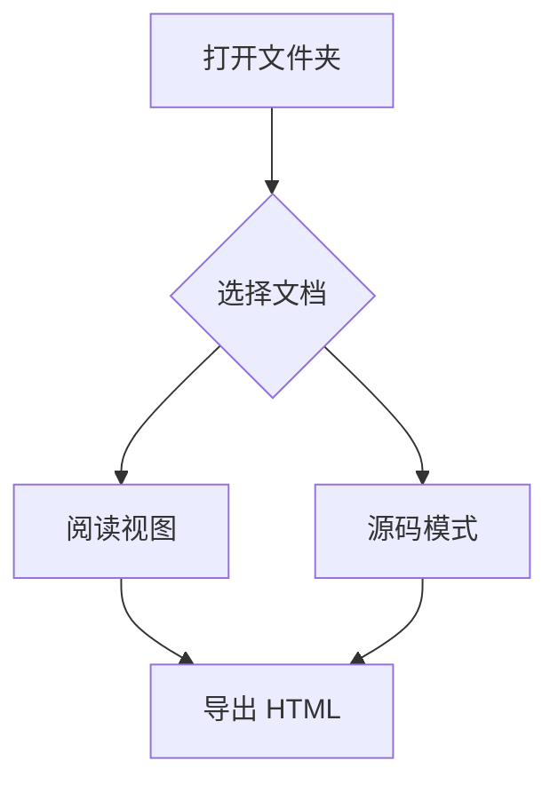
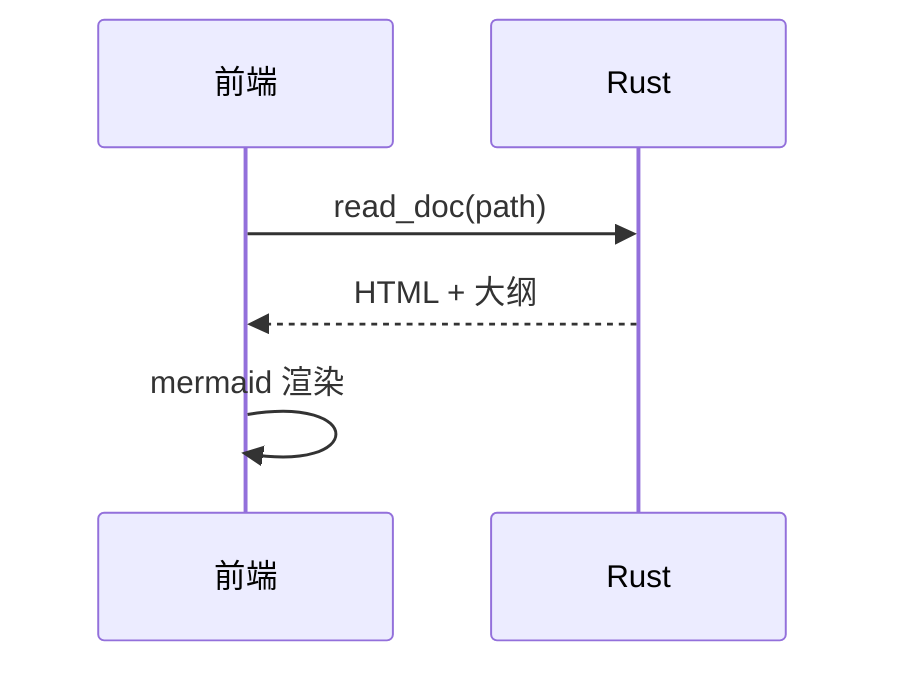

# Ruakdown 演示文档

这是一个用于验证阅读功能的示例文档,包含常见 Markdown 元素与 Mermaid 图。

## 文本样式

支持 **加粗**、*斜体*、~~删除线~~、`行内代码`,以及 [链接](https://www.rust-lang.org)。

## 列表

- 无序列表项
- [ ] 未完成任务
- [x] 已完成任务

1. 有序列表项一
2. 有序列表项二

## 表格

| 功能 | 状态 | 备注 |
| ---- | :--: | ---- |
| 文件树 | ✅ | watch 自动刷新 |
| 大纲导航 | ✅ | 滚动同步高亮 |
| Mermaid | ✅ | 前端按需渲染 |

## 引用

> 支持块引用。Rust 侧 pulldown-cmark 是唯一的渲染事实源,阅读视图、导出 HTML、内嵌 Serve 三处结果一致。

## 代码块

```rust
fn main() {
    println!("Hello, Ruakdown!");
}
```

## Mermaid 图





## 结语

大纲应包含以上全部标题,点击可跳转,滚动时自动高亮。
