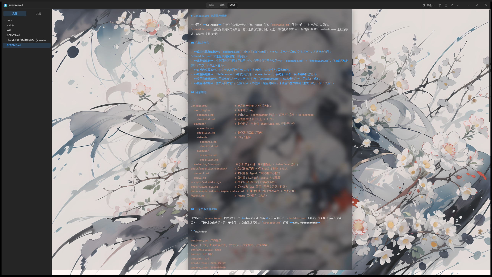
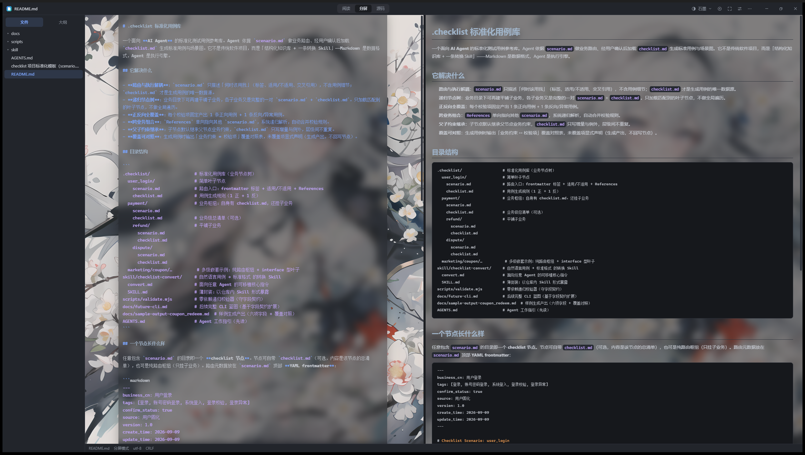
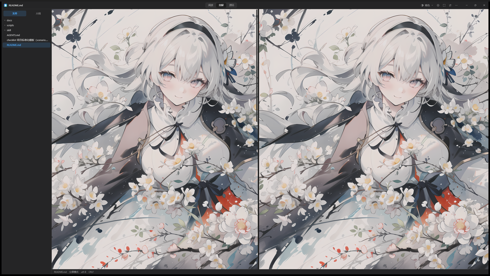

# feat-source-mode_source-mode-no-background

## 问题

源码模式没有背景图加载（阅读/分屏有背景，源码模式没有）

## 环境

| 项 | 值 |
|----|----|
| git commit | 66159a5 |
| 分支 | main |
| 平台 | win32 |
| 建档时间 | 2026-09-26T19:34:47+08:00 |
| 会话 | - |

## 调查过程

- [19:34] 建档
- [19:44] 记录日志 (chat): 源码模式无背景根因：背景层只在 .reader-wrap，.editor-wrap 缺失
- [20:12] 记录证据 3 项
- [20:13] 结案

## 日志与摘录

### [chat] 2026-09-26T19:44:50+08:00 · 源码模式无背景根因：背景层只在 .reader-wrap，.editor-wrap 缺失

```
根因（源码模式无背景）：背景图实现只挂在 .reader-wrap::before/::after（index.css 602-650，阅读/分屏预览侧），源码模式的 .editor-wrap（CodeMirror）没有任何背景层；且 .cm-content 与 .md-body 同为 max-width 860px 居中列，可复用同一套纸面/毛玻璃表面样式。用户 config.json 中 background.enabled=true（frosted, overlay 12），修复后源码模式应与阅读页同样可见墙纸。
```

## 测试场景与 E2E 用例

| # | 用例 | 步骤 | 预期 | 结果 |
|---|------|------|------|------|

## 证据截图







## 修复方案

纯 CSS 层面修复（src/index.css + src/components/SourceEditor.tsx）：① 把阅读页背景的 ::before(图片)/::after(遮罩) 选择器从 .reader-wrap 扩展到 .editor-wrap，源码模式与分屏编辑侧同时生效；② .cm-content 复用 .md-body 的两种表面样式（paper 纸面 var(--bg)、frosted 毛玻璃 rgba(--reader-overlay-rgb,0.5)+backdrop-filter）；③ SourceEditor 主题把纵向 padding（24px 顶、60vh 底）从 .cm-scroller 移入 .cm-content，让卡片完整包裹内容而不是顶部缺 24px、底部提前 60vh 断掉；④ 给 .editor-loading（以及分屏预览侧的加载占位）加 position:relative+z-index:1，防止被 z-index:0 的绝对定位背景层盖住。验证：真机截图确认源码模式与分屏模式墙纸、毛玻璃列、文字可读性全部正常。

## 复盘

① 新增 position:absolute 的装饰层（::before/::after, z-index:0）时，同一容器下所有"非定位"子元素都会被盖到图层下面——这次连"正在渲染预览…"这种加载兜底文字都被吞了，内容层和占位层都要显式 z-index。② 扩展既有视觉特性优先给现有规则加选择器（单一来源），不要复制一份规则到新容器，否则两处样式迟早漂移。③ 截图验证时注意 WebView2 从最小化还原后合成帧可能未就绪，PrintWindow 会拍到缺文字层的假象，等几秒再拍或换前台截屏。
