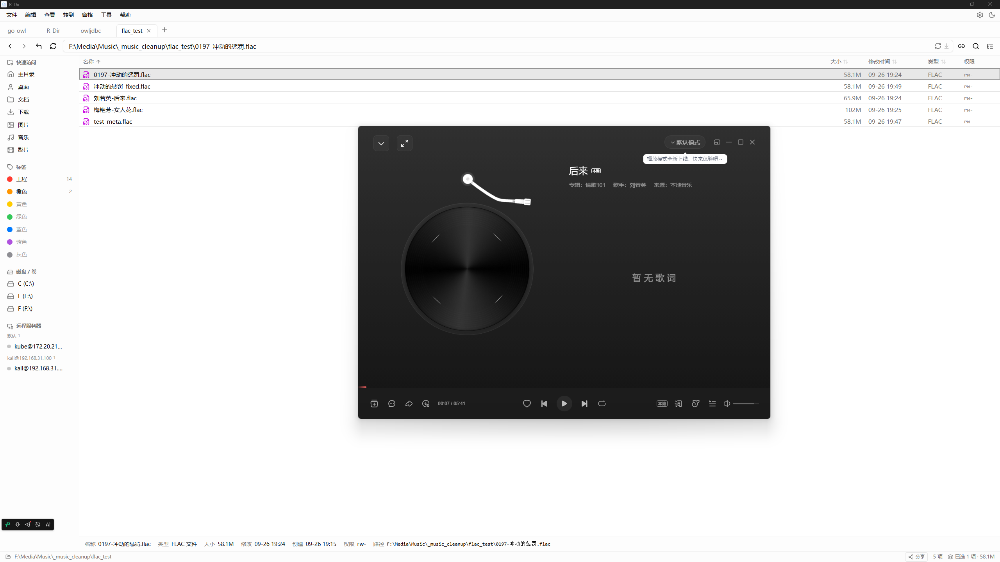
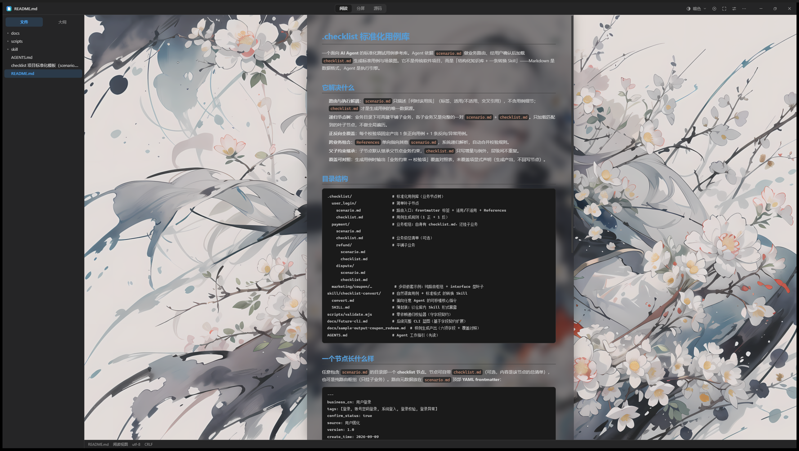
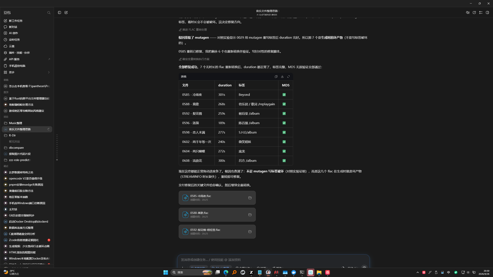

# feat-titlebar_double-window-controls

## 问题

顶部有着多一层的东西，就是关闭，放大和缩小那个（原生标题栏和自定义 TitleBar 同时存在）

## 环境

| 项 | 值 |
|----|----|
| git commit | 66159a5 |
| 分支 | main |
| 平台 | win32 |
| 建档时间 | 2026-09-26T19:34:47+08:00 |
| 会话 | - |

## 调查过程

- [19:34] 建档
- [19:44] 记录日志 (chat): 双标题栏根因：window-state 插件默认恢复 DECORATIONS 状态，覆盖了 decorations:false
- [19:58] 记录证据 1 项
- [19:58] 记录全屏截图
- [20:12] 记录证据 1 项
- [20:12] 记录证据 1 项
- [20:12] 记录终端文本快照
- [20:13] 结案
- [20:30] 记录证据 1 项
- [20:30] 记录全屏截图
- [20:34] 记录日志 (chat): v0.8.2 对照 review：功能零缺失，性能与安全无新增问题

## 日志与摘录

### [chat] 2026-09-26T19:44:50+08:00 · 双标题栏根因：window-state 插件默认恢复 DECORATIONS 状态，覆盖了 decorations:false

```
根因（双标题栏）：tauri-plugin-window-state 2.4.1 的 StateFlags::default() == all()（stateflags.rs:64-65），恢复时执行 set_decorations(state.decorated)（lib.rs:185）。用户状态文件 %APPDATA%/com.ruakdown.app/.window-state.json 保存着 "decorated": true（旧版带边框窗口写入），因此即使 tauri.conf.json 已设 decorations: false，每次启动原生标题栏仍被插件恢复出来，叠在自定义 TitleBar 之上。
```

### [chat] 2026-09-26T20:34:25+08:00 · v0.8.2 对照 review：功能零缺失，性能与安全无新增问题

```
对照 tag v0.8.2 的菜单→TitleBar 改造 code review 结论：功能零缺失。① 旧原生菜单全部项均有新家：文件(打开文件/文件夹/导出HTML→⋯菜单, 保存→Ctrl+S+autosave, 退出→窗口关闭)、视图(三模式→模式胶囊, 侧栏→⋯菜单+新增Ctrl+B)、专注/全屏/主题(10个全齐)/设置→TitleBar按钮、分享6项→⋯菜单(仅share构建)、GitHub仓库/检查更新→⋯菜单；② 唯一移除的原生"关于"对话框由本次新增的菜单底部版本号行承接；③ 性能：启动少建原生菜单、菜单动作少一次IPC跳转，快捷键并入既有capture-phase监听器，无新增轮询/定时器，编辑区背景层与阅读页同一合成模式；④ 安全：capabilities仅新增4个最小窗口权限，无新IPC命令，外链硬编码常量，CSS无外部引用，React文本自动转义；遗留项(CSP null、assetProtocol scope ** 均为v0.8.2既有，非本次引入)。
```

## 测试场景与 E2E 用例

| # | 用例 | 步骤 | 预期 | 结果 |
|---|------|------|------|------|

## 证据截图





[文本快照: 终端验证快照：Rust cargo check 通过、前端 12 文件 142 测试全过、真机截图验证单标题栏](shots/004-201257.txt)



## 修复方案

在 src-tauri/src/lib.rs 构建窗口状态插件时显式排除装饰位：tauri_plugin_window_state::Builder::default().with_state_flags(StateFlags::all() & !StateFlags::DECORATIONS)。这样该插件从保存和恢复两条路径都不再触碰 decorations，tauri.conf.json 的 decorations:false 成为唯一权威；旧状态文件里遗留的 "decorated": true 被直接忽略，存量用户无需手动删状态文件。

## 复盘

根因是"隐形配置层"：tauri-plugin-window-state 2.4.1 默认 StateFlags::all()（含 DECORATIONS），每次启动把上次退出时的边框状态恢复回来，覆盖静态配置。教训有二：① 配置"不生效"时先排查是否有插件/运行时状态在启动路径上覆盖同一配置项，配置文件之外还有 %APPDATA% 下的状态文件；② 现象本身也有迷惑性——用户当时跑着旧 dev 实例，前端经 HMR 已是新代码（能看到自定义 TitleBar）而 Rust/窗口配置还是旧的，容易误以为配置写了没用，重启完整进程链才能下结论。
